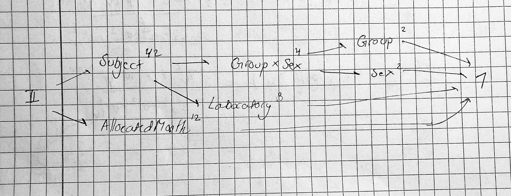

```{r setup, include=FALSE, warning=FALSE, message=FALSE}
knitr::opts_chunk$set(echo = TRUE)
```


```{r, include=FALSE, warning=FALSE, message=FALSE}
library(ggplot2)
library(MASS)
library(gridExtra)
library(tidyverse)
library(nlme)
library(lme4)
library(glmmTMB)
theme_set(theme_bw())
library(rstan)
```

```{r, include=FALSE, warning=FALSE, message=FALSE}
load("assignment2024-2.Rdata")
```

# 1.

We create the `averagedata` by using tidyverse commands, while making sure that other variables are retained whenever it makes sense. 

```{r}
blooddata1 <- blooddata %>%
  group_by(Pair) %>%
  summarise(AveBloodvolume = mean(Bloodvolume))

blooddata2 <- blooddata %>%
  dplyr::select(-c("Bloodvolume", "Pair")) %>%
  unique()

averagedata <- cbind(blooddata1, blooddata2)
```

As `Subject` and `Laboratory`, `Subject` and `GroupxSex`, `GroupxSex` and `Group` and `GroupxSex` and `Sex` are all nested the factor diagram looks like:



# 2. 

To get an impression of how blood volume varies over calendar year, between males and females and between elite skiers and control exercisers we make scatter plots with lines to illustrate the development over the year. We firstly create plots stratified according to `Sex`. We have plotted both the development for each participant, but also the average development in `AveBloodvolume` for men and women.

```{r, echo=FALSE, warning=FALSE, message=FALSE, fig.align='center', fig.width=10, fig.height=4}
months <- c("Jan", "Feb", "Mar", "Apr", "May", "Jun", "Jul", "Aug", "Sep", "Oct", "Nov", "Dec")

p1 <- ggplot(data = averagedata, aes(x = AllocatedMonth, y = AveBloodvolume)) +
  geom_point(aes(color = Sex)) + 
  geom_line(aes(group = Subject, color = Sex)) +
  scale_color_manual(values = c("male" = "darkolivegreen", female = "darkorange")) +
  ggtitle("For each participant") +
  theme(legend.position = "none") +
  scale_x_discrete(label = months)

avg_sex <- averagedata %>%
  group_by(Sex, AllocatedMonth) %>%
  mutate(AveBloodvolume = mean(AveBloodvolume))

p2 <- ggplot(data = avg_sex, aes(x = AllocatedMonth, y = AveBloodvolume)) +
  geom_point(aes(color = Sex)) + 
  geom_line(aes(group = Sex, color = Sex)) +
  scale_color_manual(values = c("male" = "darkolivegreen", female = "darkorange")) +
  ggtitle("Average for men and women") +
  theme(legend.position = "none") +
  scale_x_discrete(label = months)

p3 <- ggplot(data = avg_sex, aes(x = AllocatedMonth, y = AveBloodvolume)) +
  geom_point(aes(color = Sex)) + 
  geom_line(aes(group = Sex, color = Sex)) +
  scale_color_manual(values = c("male" = "darkolivegreen", female = "darkorange")) +
  ggtitle("Development in Average Bloodvolume for males and females")

legend_l <- cowplot::get_legend(p3)

grid.arrange(p1, p2, legend_l, ncol = 3, widths = c(3,3,1))
```
There are clear differences in the two plots. It is evident that the men have a much higher mean blood-volume than the women in our sample. This seems to be the main difference, though on average it seems, that the women have a slightly higher variation, however this is quite possibly because we have fewer observations for women than for men.

We now move on to create similar plots stratified accordin to `Group` instead.

```{r, echo=FALSE, warning=FALSE, message=FALSE, fig.align='center', fig.width=10, fig.height=4}
p1 <- ggplot(data = averagedata, aes(x = AllocatedMonth, y = AveBloodvolume)) +
  geom_point(aes(color = Group)) + 
  geom_line(aes(group = Subject, color = Group)) +
  scale_color_manual(values = c("Control" = "darkolivegreen", "Elite" = "darkorange")) +
  ggtitle("For each participant") +
  theme(legend.position = "none") +
  scale_x_discrete(label = months)

avg_grp <- averagedata %>%
  group_by(Group, AllocatedMonth) %>%
  mutate(AveBloodvolume = mean(AveBloodvolume))

p2 <- ggplot(data = avg_grp, aes(x = AllocatedMonth, y = AveBloodvolume)) +
  geom_point(aes(color = Group)) + 
  geom_line(aes(group = Group, color = Group)) +
  scale_color_manual(values = c("Control" = "darkolivegreen", "Elite" = "darkorange")) +
  ggtitle("Average for elite and control") +
  theme(legend.position = "none") +
  scale_x_discrete(label = months)

p3 <- ggplot(data = avg_grp, aes(x = AllocatedMonth, y = AveBloodvolume)) +
  geom_point(aes(color = Group)) + 
  geom_line(aes(group = Subject, color = Group)) +
  scale_color_manual(values = c("Control" = "darkolivegreen", "Elite" = "darkorange")) +
  ggtitle("Development in Average Bloodvolume")  

legend_l <- cowplot::get_legend(p3)

grid.arrange(p1, p2, legend_l, ncol = 3, widths = c(3,3,1))
```
Here there are also clear differences. On average there is both a difference in mean and quite a large variation for Control, compared to Group. For each participant it is however hard to decipher if there is a difference - it does seem that the mean is lower for `Control`, but there is also a great overlap. This is likely because we have men and women in the same plot, and as we saw earlier, there was a significant difference in the mean based on `Sex`. Thus we create plots stratified both according to `Sex` and `Group`, to get a better visualization.

```{r, echo=FALSE, warning=FALSE, fig.align='center', fig.width=10, fig.height=7.5}
p1 <- ggplot(data = averagedata, aes(x = AllocatedMonth, y = AveBloodvolume)) +
  geom_point(aes(color = Group)) + 
  geom_line(aes(group = Subject, color = Group)) +
  scale_color_manual(values = c("Control" = "darkolivegreen", "Elite" = "darkorange")) +
  facet_wrap(~Sex)+
  ggtitle("Bloodvolume for each participant") +
  scale_x_discrete(label = months)

avg_grp <- averagedata %>%
  group_by(Group, AllocatedMonth, Sex) %>%
  mutate(AveBloodvolume = mean(AveBloodvolume))

p2 <- ggplot(data = avg_grp, aes(x = AllocatedMonth, y = AveBloodvolume)) +
  geom_point(aes(color = Group)) + 
  geom_line(aes(group = Group, color = Group)) +
  scale_color_manual(values = c("Control" = "darkolivegreen", "Elite" = "darkorange")) +
  facet_wrap(~Sex)+
  ggtitle("Development in Average Bloodvolume") +
  scale_x_discrete(label = months)

grid.arrange(p1, p2, nrow = 2)
```
We can here see the same effects as for the earlier plot for men and women. We can now also see, that there seems to be a bigger difference between Control and Elite for women. For men the difference is not as great neither on average or for each individual participant. For each individual male, there is a bigger spread in the mean for the Elite group, than the Control.

We also note, that there is a significant increase on average for both men and women in august. We check our data to see which participants this stems from
```{r, echo=FALSE, fig.width=5, fig.height=2.5}
# Subset the data for August and Control group
aug <- averagedata[(averagedata$AllocatedMonth == "08_August" & averagedata$Group == "Control"), ]

# Sort data by AveBloodvolume in descending order
aug <- aug[order(-aug$AveBloodvolume), ]

# Combine the two subsets into one table
top_female <-  cbind(Group = "Female", aug[aug$Sex == "female", c(2,3)])
top_male <-  cbind(Group = "Male", aug[aug$Sex == "male"][1:5, c(2,3)])
top_female <- rbind(top_female, data.frame(Group = "Female", Subject = rep(NA, 4), AveBloodvolume = rep(NA, 4)))

top_combined <- data.frame(
  Male_Subject = top_male$Subject,
  Male_AveBloodvolume = top_male$AveBloodvolume,
  Female_Subject = top_female$Subject,
  Female_AveBloodvolume = top_female$AveBloodvolume
)

# Load knitr library
library(knitr)

# Display the combined table
kable(top_combined, caption = "Top 5 Males and Females with Highest AveBloodvolume")

```

So for women we only have a single observation from August - which most likely explains the jump. For men there does not seem to be an alarming difference between the observations, so the jump does not seem to stem from an outlier. Thus we will not investigate this tendency further.

# 3.

We initially fit a model with the original average blood volume `AveBloodvolume` as response:

```{r}
mod1 <- lmer(AveBloodvolume ~ Sex + Group + Sex:Group + Laboratory + Weight + 
               (1|Subject), data = averagedata)
summary(mod1)
```
The parameters `Sexmale` and `GroupElite` are estimated to `1324.56` and `987.89` with standard error `338.92` and `610.86` respectively. The interaction term `Sexmale:GroupElite` is estimated to `319.20` with standard error `467.38`. We refrain from testing the significance of the effects at this point, as we carry out tests in a later exercise.

We proceed to fit the log10-transformed `AveBloodvolume` as response:

```{r}
mod2 <- lmer(log10(AveBloodvolume) ~ Sex + Group + Sex:Group + Laboratory +
               Weight + (1|Subject), data = averagedata)
summary(mod2)
```

The parameters `Sexmale` and `GroupElite` are estimated to `0.110` and `0.088` with standard error `0.025` and `0.045` respectively. The interaction term `Sexmale:GroupElite` is estimated to `-0.036` with standard error `0.034`. Again, we refrain from testing the significance of the effects at this point, as we carry out tests in a later exercise.

As a quick diagnostic of the two models we plot the residuals against the fitted values for both models as well as QQ-plots for both models. First the model with `AveBloodvolume` as response:

```{r, echo=FALSE, fig.align='center', fig.height=2, fig.width=3, message=FALSE, warning=FALSE}
mod1res <- mod1 %>% residuals()
mod1fitted <- mod1 %>% fitted()

mod1Diag <- data.frame(residuals = mod1res, fitted = mod1fitted)

ggplot(mod1Diag, aes(x = fitted, y = residuals)) + 
  geom_point() + 
  geom_smooth() +
  theme_bw() +
  labs(x = "Fitted values", y = "Residuals")
```


```{r, echo=FALSE, fig.align='center', fig.height=3.5, fig.width=5, message=FALSE, warning=FALSE}
qqnorm(mod1res)
```

We note, that the residuals tend to have a slightly higher variance for high fitted values compared to small fitted values suggesting heteroschedastic residuals and as a consequence the model does not capture the mean structure of the data very well. The QQ-plot appears to be reasonable. We make similar plots for the model with `log10(AveBloodvolume)` as response:

```{r, echo=FALSE, fig.align='center', fig.height=2, fig.width=3, message=FALSE, warning=FALSE}
mod2res <- mod2 %>% residuals()
mod2fitted <- mod2 %>% fitted()

mod2Diag <- data.frame(residuals = mod2res, fitted = mod2fitted)

ggplot(mod2Diag, aes(x = fitted, y = residuals)) + 
  geom_point() + 
  geom_smooth() +
  theme_bw() +
  labs(x = "Fitted values", y = "Residuals")
```


```{r, echo=FALSE, fig.align='center', fig.height=3.5, fig.width=5, message=FALSE, warning=FALSE}
qqnorm(mod2res)
```

It appears from the above plot, that log-transforming the response solved the problem of heteroschedastic residuals. The residuals appear to be randomly scattered around 0 and we therefore conclude that this model captures the mean structure of the data reasonably well. The QQ-plot looks fine again.

*Note: Hun nævnte til forelæsningen at man transformere når vi har skewed data, men det havde vi ikke vel?*

*The log transformation further more changes the way we model effects from additive to multiplicative. It could be that there was a preference in this regard, but we are not aware of such. - Synes vi skal skrive dette her også bare just in case (Dina)*

# 4. 

Note that performing tests regarding the median of expected average blood volume corresponds to performing tests regarding the median of expected $\log_{10}$ transformed average blood volume. Thus a significant result regarding the median on log scale, nicely translates to a significant result regarding the median on untransformed scale. Since the median is equal to the mean in the normal distribution, we can carry on with or tests as per usual.

To test whether the median of average blood volume between Elite and Control subjects differs between women and men we test the following hypothesis.

$$H_0: \beta_{\text{Sex}\times\text{Group}}=0$$
First we perform a LRT using the $\chi^2$-distribution to compute the p-value:
```{r}
mod_red1 <- lmer(log10(AveBloodvolume) ~ Sex + Group + Laboratory + Weight + (1|Subject), 
             data = averagedata)
anova(mod2, mod_red1)
```
The LRT results in an insignificant p-value of 0.2506. Since the $\chi^2$ distribution is only an assumption that is true asymptotically, we must be careful with the p-value. The p-value is quite large, so we are not likely to get a different result by simulation, nonetheless we, in order to verify our results, compute an empirical p-value by simulating under the null hypothesis. 

```{r, fig.width=10, fig.height=4, fig.align='center', echo = FALSE, warning = FALSE, message = FALSE}
# Simulated p-value in test for TVset
sim1 <- pbkrtest::PBmodcomp(mod2, mod_red1, nsim=2000, seed=967)
sim1

# Extract simulated LRTs
LRT_int <- as.numeric(sim1$ref)

# Density for chi-square with df=1
dchisq1 <- function(x) dchisq(x,df=1)

# Histogram with overlaid density
p1 <- data.frame(LRT_int = LRT_int) |> 
  ggplot(aes(x = LRT_int)) + 
  geom_histogram(aes(y = ..density..), breaks=seq(0,18,0.5), color="black", fill="white") +
  geom_function(fun = dchisq1, colour = "red", xlim=c(0.12,15), linewidth=1) +
  xlab("LRT") + ylab("Density") + ggtitle("Test for interaction effect") +
  geom_vline(xintercept=1.3197, color="blue",linewidth=1, linetype="dashed")

#  Histogram of transformed LRT values
p2 <- data.frame(x = 1-pchisq(LRT_int, 1)) |> 
  ggplot(aes(x = x)) + 
  geom_histogram(aes(y = ..density..), color="black", fill="white") +
  geom_hline(yintercept = 1, colour = "red", linetype="dashed") +
  xlab("1 - pchisq(LRT)") + ylab("Density") + ggtitle("Test for interaction effect")

grid.arrange(p1, p2, ncol = 2)
```
The simulations result in a p-value of 0.3013, which is even more insignificant than the one we got using the $\chi^2_1$ assumption. To check the approximation we have plotted the histogram of the distribution of the simulated LRT together with the density curve of the $\chi^2_1$ distribution, as well as a histogram of a transformation of the simulated LRT values. The transformation performed is $1 - F(LRT)$, and the transformed values should be uniformly distributed if the $\chi^2_1$ approximation is valid. From the plots we conclude, that the approximation is not perfect, but not too bad either.

We can also test the hypothesis by using the Wald test statistic with the normal approximation, resulting in the following p-value:

```{r}
# Summary with Wald test statistics but not p-value
mod2 %>% summary() %>% coefficients()

# p-value from asymptotic N(0,1)
2*pnorm(-1.0569530)
```
The p-value is 0.290533 which is in concordance with the other tests. As with the $\chi^2$ approximation the Wald test statistic will asymptotically under the null follow a normal distribution. One must therefore also be critical of the p-value. And last but not least we perform an approximate F-test using the Satterthwaite's approximation:

```{r}
lmerTest::lmer(log10(AveBloodvolume) ~ Sex + Group + Sex*Group + Laboratory + Weight + (1|Subject), 
             data = averagedata) |> drop1()
```
The approximate F-test results in an insignificant p-value similar to the other ones we have obtained. The test statistic follows an exact F distribution when the design is particularly nice in the way described in the lecture notes. *Hvad betyder denne her linje?*

All tests result in insignificant p-values, and we conclude that we cannot reject the null hypothesis, and thus we do not find evidence that the median  in expected average blood volume between Elite and Control differs between men and women. We continue with the model `mod_red1`. 

To test whether there is an overall difference in median average blood volume between Elite and Control subjects, we test the following hypothesis:

$$H_0: \beta_{Group} = 0$$

In the model `mod_red1`. As before we start out by computing the p-value using the the asymptotic $\chi^2$ approximation:

```{r}
mod_red2 <- lmer(log10(AveBloodvolume) ~ Sex + Laboratory + Weight + (1|Subject), 
             data = averagedata)
anova(mod_red1, mod_red2)
```

The effect is not significant with a significance level of 0.05. We again compute an empirical p-value by simulating under the null. 

```{r, fig.width=10, fig.height=4, fig.align='center', echo = FALSE, warning = FALSE, message = FALSE}
# Simulated p-value in test for Group
sim2 <- pbkrtest::PBmodcomp(mod_red1, mod_red2, nsim=2000, seed=967)
sim2

# Extract simulated LRTs
LRT_group <- as.numeric(sim2$ref)

# Histogram with overlaid density
p1 <- data.frame(LRT_group = LRT_group) |> 
  ggplot(aes(x = LRT_group)) + 
  geom_histogram(aes(y = ..density..), breaks=seq(0,18,0.5), color="black", fill="white") +
  geom_function(fun = dchisq1, colour = "red", xlim=c(0.12,15), linewidth=1) +
  xlab("LRT") + ylab("Density") + ggtitle("Test for Group effect") +
  geom_vline(xintercept=3.2087, color="blue",linewidth=1, linetype="dashed")

#  Histogram of transformed LRT values
p2 <- data.frame(x = 1-pchisq(LRT_group, 1)) |> 
  ggplot(aes(x = x)) + 
  geom_histogram(aes(y = ..density..), color="black", fill="white") +
  geom_hline(yintercept = 1, colour = "red", linetype="dashed") +
  xlab("1 - pchisq(LRT)") + ylab("Density") + ggtitle("Test for Group effect")

grid.arrange(p1, p2, ncol = 2)
```

The simualted p-value is  $0.09345$, and both tests thus result in p-values larger than 0.05, and we conclude that we cannot reject the null hypothesis, and thus we do not find evidence that there is an overall difference in expected blood volume between Elite and Control subjects. As before the approximation is not perfect, but not too bad either. 

# 5. 
The correlation structure from (1) is not reasonable, because we are comparing different time-points. There could perhaps be a seasonal dependence-structure. Furthermore, there is also a great possibility that the correlation is greater between two variables with timepoints close to eachother i.e there is a strong possibility that samples from march and april are more strongly correlated than samples from march and december, and the previous model did not allow for this possibilty.

We fit the model with the AR1-term using `glmmTMB`. As we may want to carry out hypothesis-tests later on, we will simply use the ML-estimates instead of the REML estimates, even though the ML-estimates are slightly biased.
```{r}
mod3 <- glmmTMB(log10(AveBloodvolume) ~ Group + Sex + Weight + Laboratory + 
                  (1|Subject) + ar1(Time-1|Subject), data=averagedata)
```
We read of the different estimates:
```{r}
VarCorr(mod3)
```

```{r, echo=FALSE}
tau_u <- 3.9349e-02
sigma_w <- 1.9828e-02
phi <- 0.167
sigma <- summary(mod3)$sigma
```

That is: $\tau_U = 3.9349e-02$, $\sigma_W = 1.9828e-02$, $\phi = 0.167$, $\sigma = 2.1931e-05$.

The formula for the variance of $\log_{10} Y_{ij}$ is:
$$Var(\log_{10} Y_{ij}) = V(U_i) + V(\epsilon_i) + V(W_{ij}) = \tau_U^2 + \sigma^2 + \sigma^2_{W}$$
Where we have used the independence of $W_{ij}$, $U_{i}$ and $\epsilon_{ij}$. We plug in our estimates for $\tau_U$, $\sigma_W$ and $\sigma$ and get an estimate of $V(\log_{10} Y_{ij})$
```{r, echo=FALSE}
var_y <- tau_u^2 + sigma^2 + sigma_w^2
var_y
```
The standard deviation is simply found by taking the squareroot of the estimated variance, so our estimate is:
```{r, echo=FALSE}
sd_y <- sqrt(var_y)
sd_y
```

# 6.

To compute the correlation $Corr(\log_{10} Y_{i,1}, \log_{10} Y_{i,2})$, we first determine the covariance $Cov(\log_{10} Y_{i,1}, \log_{10} Y_{i,2})$:

$$Cov(\log_{10} Y_{i,1}, \log_{10} Y_{i,2}) = Cov(X_{i1}\beta + U_i + W_{i1} + \epsilon_{i1}, X_{i2} \beta + U_i + W_{i2} + \epsilon_{i2}) = VU_i + Cov(W_{i1}, W_{i2}) = \tau_U^2 + \sigma^2_W \phi^{|t_2-t_1|}$$
Note that most covariance terms evaluate to zero because of independence between the $U_i$'s, $\epsilon_{ij}$'s and $W_{ij}$'s. The correlation is thus:

$$Corr(\log_{10} Y_{i,1}, \log_{10} Y_{i,2}) = \frac{Cov(\log_{10} Y_{i,1}, \log_{10} Y_{i,2})}{\sqrt{V(\log_{10} Y_{i,1}) V(\log_{10} Y_{i,2})}} = \frac{\tau^2_U + \sigma^2_W \phi^{|t_2 - t_1|}}{\tau_U^2 + \sigma^2_W + \sigma^2}$$

Plugging in the estimates from the fitted model gives an estimate of $Corr(\log_{10} Y_{i,1}, \log_{10} Y_{i,2})$

```{r, echo=FALSE}
corr_func <- function(tu_2 = tau_u^2, sigmaW_2 = sigma_w^2, sigma_2 = sigma^2, corr = phi, t1, t2){
  nom <- tu_2 + sigmaW_2 * corr^(abs(t2 - t1))
  denom <- tu_2 + sigmaW_2 + sigma_2
  return(nom/denom)
}

corr_func(t1 = 1, t2 = 2)
```

Similar derivations reveal that 

$$Corr(\log_{10} Y_{i,1}, \log_{10} Y_{i,12}) = \frac{\tau^2_U + \sigma^2_W \phi^{|t_{12} - t_1|}}{\tau_U^2 + \sigma^2_W + \sigma^2}$$
and plugging in the model estimates gives an estimate for $Corr(\log_{10} Y_{i,1}, \log_{10} Y_{i,12})$ of:

```{r, echo=FALSE}
corr_func(t1 = 1, t2 = 12)
```

We can use a similar argument for the final one:

$$Corr(\log_{10} Y_{i,1}, \log_{10} Y_{i,1+1/30}) = \frac{\tau^2_U + \sigma^2_W \phi^{|t_{1} - t_{1+1/30}|}}{\tau_U^2 + \sigma^2_W + \sigma^2}$$
Which gives an estimate of $Corr(\log_{10} Y_{i,1}, \log_{10} Y_{i,1+1/30})$:
```{r, echo=FALSE}
corr_func(t1 = 1, t2 = 1 + 1/30)
```

# 7.

We fit the model:
```{r}
mod4 <- glmmTMB(log10(AveBloodvolume) ~ Group + Sex + Weight + Laboratory +
          (Group-1||Subject), dispformula=~Group-1, data=averagedata)
```

And we extract estimates corresponding to the variance of the random effects with the command `VarCorr`. 

```{r}
VarCorr(mod4)
```
That is is $\tau_{U,\text{Elite}} = 0.036979$ and $\tau_{U,\text{Control}} = 0.042160$ 
```{r, echo = FALSE}
tau_u_elite <- 0.036979
tau_u_control <- 0.042160
```

To find the estimates of $\sigma_{\text{Elite}}$ and $\sigma_{\text{control}}$ we use the command `fixef`. We remember to exponentiate the estimates since the `glmmTMB`function uses the log link in the dispersion model.

```{r}
exp(fixef(mod4)$disp)
```
So our estimates for the variance of the residuals are $\sigma_{\text{control}} = 0.01916792$ and $\sigma_{\text{Elite}} = 0.01975819$

```{r, echo = FALSE}
sigma_elite <- exp(fixef(mod4)$disp[2])
sigma_control <- exp(fixef(mod4)$disp[1])
```
We note that there is only a very small difference in these estimates, suggesting that the residual variance in the two groups is quite similar.  

# 8. 
We first attempt to fit the model with all additive effects included alongside the AR1-term and the group-stratified subject specific variance
```{r}
mod5_i <- glmmTMB(log10(AveBloodvolume) ~ Group + Sex + Weight + Laboratory +
                  ar1(Time-1|Subject) + (Group-1||Subject), 
                dispformula=~Group-1, data=averagedata)
```
But we get a warning, which results in NA-values for AIC, BIC and logLikelihood. This warning is due to numerical issues when fitting the model. One of the reasons it can arise, is if some of the predictor-variables are insignificant. We can see, which ones are causing issues by running the command `diagnose`. 
```{r}
diagnose(mod5_i)
```
We here see that including the intercept seems to be the main reason why we get non-positive eigenvalues in the Hessian. We then removed the intercept, to see if we could avoid numerical issues in this way. However, this did not solve the numerical issues, and repeating the process using `diagnose` we saw, that including the `Group` was what was causing problems. As such we have also removed `Group`, to fit the model below, which does not encounter numerical issues:

```{r}
mod5 <- glmmTMB(log10(AveBloodvolume) ~ -1 + Sex + Weight + Laboratory +
                  ar1(Time-1|Subject) + (Group-1||Subject), 
                dispformula=~Group-1, data=averagedata)
```
We can now compare the AIC-values for the different models. We have included the $\log_{10}$-transformed model from Question 3, the final model from Question 4 (without Group or Interaction) and the models from Questions 5 and 7 alongside of course the model which we just fitted. Below are the AIC-values for all models.
```{r, echo=FALSE}
q <- c(3,4,5,7,8)

AIC <- c(AIC(mod2), AIC(mod_red2), AIC(mod3), AIC(mod4),AIC(mod5))
form <- c(as.character(mod2@call$formula), as.character(mod_red2@call$formula), 
          as.character(formula(mod3)), as.character(formula(mod4)),
                                                    as.character(formula(mod5)))


df <- data.frame("Q" = q, "AIC" = AIC, "Formula" = form[c(3,6,9,12,15)] )
knitr::kable(df)
```
The AIC-value is an estimate of how much information is lost, when we fit the different models. Thus we are interested in minimizing the AIC. So based on these AIC-values, the model from Question 5 performs the best.

This tells us, that the most optimal variance and covariance structure, is the one where we allow for the correlation to vary depending on how close two observations are in time, but that allowing the variance to differ between groups, does not seem to create a better model-fit. So the first models, where we assume indpendence between timeperiods and the ones where we include Group-specific variation do not fit as well as the model, where we assume the variance to be independent of Group but dependent on the observations from other timeperiods, weighted by how close observations are in time. I.e that the Correlation structure described in Question 6 is the one that allows for the best fit.


# 9. 

Based on the AICs from Question 8. we choose the model from Question 5. We refit the model including the `AllocatedMonth` variable:

```{r}
mod6 <- glmmTMB(log10(AveBloodvolume) ~ Group + Sex + AllocatedMonth + Weight +
                  Laboratory + (1|Subject) + ar1(Time-1|Subject),
                data=averagedata)
```
We then carry out a hypothesis test for the effect of `AllocatedMonth` using the `anova()` command:

```{r}
anova(mod6, mod3)
```

We get a p-value of 0.3721 which imply that we cannot reject the null-hypothesis: That `AllocatedMonth` has no effect which suggests, that it is not important to include in the model.

By printing a summary of the model

```{r}
summary(mod6)
```
we see that the p-value for `GroupElite` is `0.0593` so on a 95% significance level it is not significant. It is worth noting that it is a borderline p-value but the conclusion has not changed from the previous question.

# 10. 

*Assume that the gamma distributions for both* $F_{i}'s$ *and* $G_{ij}'s$ *have the shape parameter equal to the rate parameter. Why is this appropriate?*

The mean of a gamma distributed random variable $U$ with shape $\alpha$ and rate $\lambda$ is given by $EU = \frac{\alpha}{\lambda}$. If we let $\alpha = \lambda$ we get

$$\alpha = \lambda  \Rightarrow EU =  \frac{\alpha}{\lambda} = 1 $$
So the multiplicative model where $F_i$ and $G_{ij}$ both have mean $1$ corresponds to the additive model where the mean of $U_i$ and $\epsilon_{ij}$ is $0$. This corresponds to the standard assumptions about the mean of the random effects and residuals.

*What is the conditional distribution of* $Y_{ij}$ *given* $F_i$*? Check for yourself that this is what is implemented in the Stan code.*

Let the shape and rate parameter of the Gamma distribution of $G_{ij}$ be denoted by $\alpha_2$, then

$$Y_{ij}|F_i = 10^{X_{ij}\beta}F_iG_{ij}|F_i \stackrel{D}{=} \text{Gamma}(\alpha_2, \frac{\alpha_2}{10^{X_{ij}\beta}F_i})$$
Since we condition on $F_i$ the whole term $10^{X_{ij}\beta}F_i$ can be regarded as a constant and the second distributional equality follows from properties of the Gamma distribution. 

In the Stan code we have specified the distribution of $Y_{ij}$ as `gamma(shapeG, shapeG/pow(10,X*beta+Z*U))` which is exactly what we have stated above ($Z$ is the model matrix for the random effects). 

*Which priors are used for (hyper)parameters in the Stan program? Explain why it is certain that the posterior is a proper distribution.*

For $\beta$ we use a $\mathcal{N}(0,10)$, for $shape_F$ and $shape_G$ we use $Gamma(1,1)$, for $F$ we use $Gamma(shape_F, shape_F)$. We are certain that the posterior is a proper distribution as all the priors are proper priors. we know they are proper, as they are all given by well-defined probability distributions.

# 11.
We first need to make a list consisting of our data, and the various parameters and modelmatrices needed for the Stan-program.

```{r}
# To return number of predictors
fixef_MM <- mod1 %>% model.matrix() 
ranef_MM <- mod1 %>% getME(name="Z") %>% as.matrix() 
```


```{r}
noObs <- nrow(fixef_MM)               # number of obs 
p <- ncol(fixef_MM)                   # number of predictors
noSubj <- ncol(ranef_MM)              # number of subjects 
y <- averagedata$AveBloodvolume       # response, i.e. untransformed average bloodvolume
X <- fixef_MM                         # Model matrix for fixed effects
Z <- ranef_MM                         # Model matrix for random effects
```


```{r}
data_list <- list(noObs = noObs,
                  p = p,
                  noSubj = noSubj,
                  y = y,
                  X = X,
                  Z = Z)
```

We can then run the Stan-program to to obtain Markov chains for all parameter estimates
```{r, warning=FALSE, echo=FALSE}
library(rstan)

regFit <- stan(
  file = "lmm-gamma.stan",  # Stan program
  data = data_list,    # named list of data
  chains = 4,         # number of Markov chains
  warmup = 750,      # number of warm-up iterations per chain
  iter = 3000,        # total number of iterations per chain
  cores = 4,          # number of cores (could use one per chain)
  refresh = 0         # no progress shown
)
```
We can then use `traceplot` to obtain traceplots for both $\beta$, the shape parameters for the gamma-distribution and $F_i$ and $G_{ij}$:
```{r, warning=FALSE, message=FALSE}
par <- c("beta[1]","beta[2]", "beta[3]","beta[4]","beta[5]","beta[6]","beta[7]","shapeF", "shapeG")
traceplot(regFit, pars = par)
```

From the traceplots it appear that the markov chains have converged to the same stationary distribution i.e all chains have mixed and remain stationary. 

```{r, echo=FALSE, warning=FALSE, eval=FALSE}
sim <- rstan::extract(regFit)
hist(sim$beta[,1], main="") 
```


# 12. 

Let $X_{ij,A}, X_{ij,B}$ and $X_{ij,C}$ be the covariate information corresponding to a blood sample belonging to an elite female skier with body weight 80 kg from respectively lab A, B and C. 

```{r}
Xij_a <- c(1, 0, 1, 0, 0, 80, 0)
Xij_b <- c(1, 0, 1, 1, 0, 80, 0)
Xij_c <- c(1, 0, 1, 0, 1, 80, 0)
```

In order to get samples from the posterior distribution for $\mu = E(Y_{ij}|X_{ij}) = 10^{X_{ij} \beta}$ we can use the simulations from the posterior distribution of $\beta$ created by the `stan` command in the previous question. For each draw from the posterior we calculate three values $\mu_A = 10^{X_{i, Aj} \beta}$, $\mu_B = 10^{X_{ij, B} \beta}$ and $\mu_C = 10^{X_{ij, C} \beta}$, corresponding to the expected blood volume of the elite female skier from respectively lab A, B and C. 

```{r}
mu_a <- 10^(as.matrix(sim$beta) %*% Xij_a)
mu_b <- 10^(as.matrix(sim$beta) %*% Xij_b)
mu_c <- 10^(as.matrix(sim$beta) %*% Xij_c)
```

To find the average over the three labs, we for each draw take the average of $\mu_A$, $\mu_B$ and $\mu_C$.

```{r}
EY <- numeric(1400)

for (i in 1:1400){
  EY[i] <- mean(mu_a[i], mu_b[i], mu_c[i])
}
```

Now we can simply take the mean of the draws from the posterior of $\mu$, and obtain the posterior mean of $\mu$ to be:

```{r, echo=FALSE}
mean(EY) %>% knitr::kable(col.names = " ")
```

By taking the quantiles of the simulations from the posterior we find the posterior interval for $\mu$ to be:

```{r, echo=FALSE}
t(quantile(EY, c(0.025, 0.975))) %>% knitr::kable() 
```

